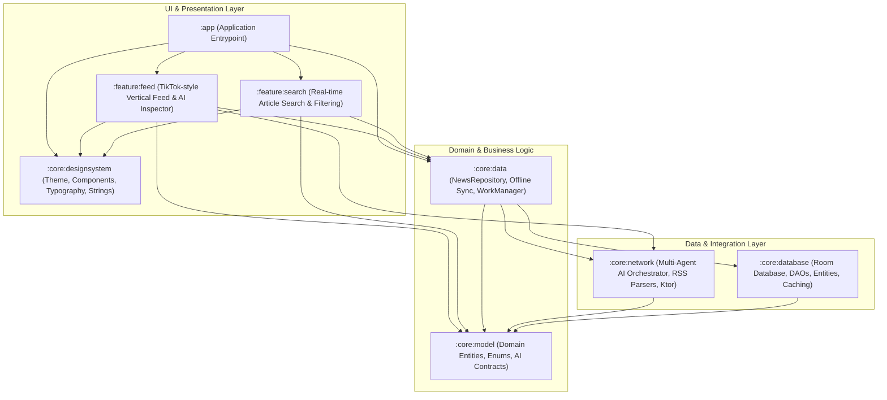
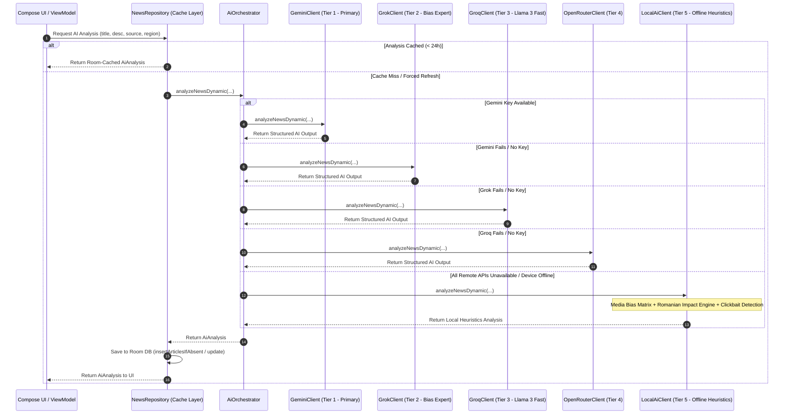

# 🏗️ FlashNews AI — System Architecture & Design

FlashNews AI is built with modern Android architectural principles, utilizing Jetpack Compose, Kotlin Coroutines & Flow, Room SQLite Persistence, Ktor Multiplatform Networking, and a 5-Tier Resilient Multi-Agent AI System.

---

## 📐 1. High-Level Modular Architecture

The application is structured into decoupled Gradle modules following Clean Architecture principles:

---

## 🤖 2. Multi-Agent AI Orchestration (5-Tier Resilient Fallback)

FlashNews AI delivers uninterrupted intelligence using an adaptive failover chain:

---

## 💾 3. Data Ingestion & Offline-First Strategy

1. **RSS & API Ingestion**: Over 150 RSS feeds spanning Romania (National, Regional, Economic, Tech, Defense) and Global outlets (Reuters, BBC, AP, Politico, TechCrunch) are fetched concurrently.
2. **Room Database Cache**:
   - `insertArticlesIfAbsent`: Preserves existing user favorites and AI summaries from being overwritten during background synchronization.
   - Paging 3 integration provides smooth 60fps vertical paging with instant cache hydration.
3. **Background Sync**: `NewsSyncWorker` runs periodically via Android WorkManager with network constraints.

---

## 🛡️ 4. Security & Network Hygiene

- **Strict HTTPS**: Enabled by default in `network_security_config.xml`.
- **Cleartext Whitelist**: Explicitly restricted only to verified Romanian news outlets lacking full HTTPS RSS endpoints.
- **Zero Sensitive Data Logging**: API keys and tokens are strictly excluded from console logs.
- **R8 / ProGuard Optimization**: Fully configured in `app/proguard-rules.pro` for release builds.
